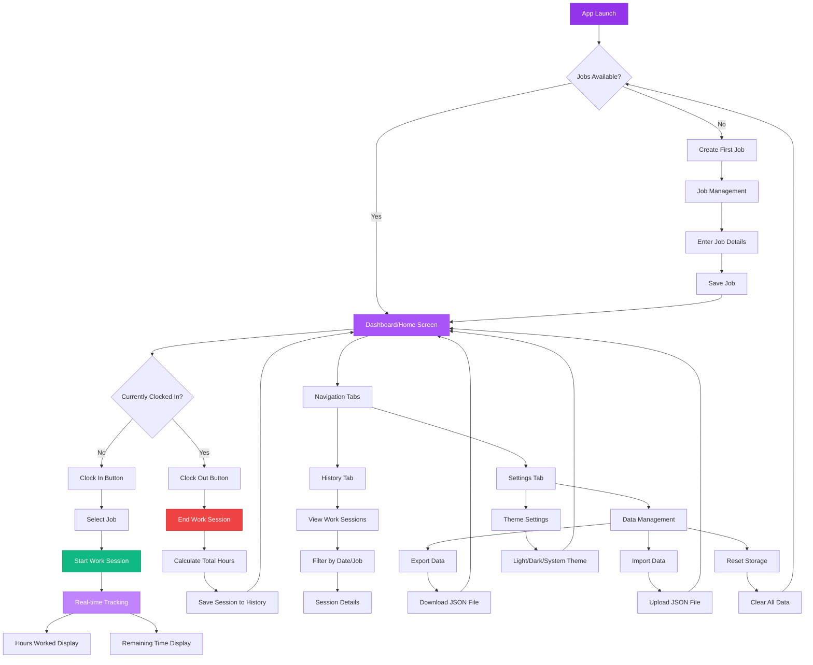

# DailyReport - Work Hours Tracker 📊

A modern, intuitive mobile application for tracking daily work hours and managing job tasks. Built with React Native and Expo, featuring a beautiful glass-morphism UI design with both light and dark themes.

## Features ✨

- **Time Tracking**: Clock in/out functionality with real-time hours calculation
- **Job Management**: Create, edit, and organize multiple work projects
- **Session History**: View detailed work session history with filtering options
- **Data Export/Import**: Backup and restore your data with JSON export/import
- **Theme Support**: Beautiful light and dark themes with glass-morphism design
- **Responsive Design**: Optimized for mobile devices with intuitive navigation
- **Real-time Updates**: Live tracking of hours worked and remaining time
- **Encouragement System**: Motivational messages when approaching work goals

## App Flow 🔄



## Screenshots 📱

The app features a modern purple-themed design with:
- Clean dashboard showing current work status
- Intuitive job management interface
- Comprehensive history tracking
- Flexible settings and data management

## Tech Stack 🛠️

- **React Native** with Expo
- **TypeScript** for type safety
- **Expo Router** for navigation
- **AsyncStorage** for local data persistence
- **React Context** for state management
- **Glass-morphism UI** components

## Getting Started 🚀

### Prerequisites

- Node.js (v16 or higher)
- npm or yarn
- Expo CLI
- Android Studio (for Android builds) or Xcode (for iOS builds)

### Installation

1. Clone the repository
   ```bash
   git clone https://github.com/KevinCalvinNaeem/DailyReport.git
   cd DailyReport
   ```

2. Install dependencies
   ```bash
   npm install
   ```

3. Start the development server
   ```bash
   npx expo start
   ```

4. Run on your preferred platform:
   - **Android**: Press `a` or scan QR code with Expo Go
   - **iOS**: Press `i` or scan QR code with Expo Go
   - **Web**: Press `w` to open in browser

## Building for Production 🏗️

### Android APK

1. Generate Android project:
   ```bash
   npx expo prebuild --platform android
   ```

2. Build release APK:
   ```bash
   cd android
   ./gradlew assembleRelease
   ```

The APK will be generated at: `android/app/build/outputs/apk/release/app-release.apk`

### Using EAS Build (Alternative)

```bash
npx eas build --platform android
```

## Project Structure 📁

```
DailyReport/
├── app/                    # Main application screens
│   ├── (tabs)/            # Tab-based navigation
│   │   ├── index.tsx      # Dashboard/Home screen
│   │   ├── history.tsx    # Work history screen
│   │   └── settings.tsx   # Settings and data management
│   └── _layout.tsx        # Root layout
├── components/            # Reusable UI components
├── context/              # React Context providers
├── types/                # TypeScript type definitions
├── assets/               # Images, fonts, and static assets
└── scripts/              # Utility scripts
```

## Key Features Explained 🔍

### Time Tracking
- One-tap clock in/out functionality
- Real-time calculation of hours worked
- Remaining time display based on expected work hours
- Automatic session management

### Job Management
- Create and organize multiple work projects
- Edit job details and descriptions
- Active/inactive job status management
- Quick job switching during work sessions

### Data Management
- Export work data as JSON for backup
- Import previously exported data
- Local storage with AsyncStorage
- Data persistence across app sessions

### Theming
- Automatic system theme detection
- Manual theme switching (Light/Dark/System)
- Glass-morphism design elements
- Purple color scheme with excellent contrast

## Version History 📝

- **v1.2.0** - Latest release with improved time tracking and UI enhancements
- **v1.1.0** - Added custom alerts and mobile layout improvements
- **v1.0.0** - Initial release with core functionality

## Contributing 🤝

1. Fork the repository
2. Create a feature branch (`git checkout -b feature/amazing-feature`)
3. Commit your changes (`git commit -m 'Add amazing feature'`)
4. Push to the branch (`git push origin feature/amazing-feature`)
5. Open a Pull Request

## License 📄

This project is licensed under the MIT License - see the LICENSE file for details.

## Support 💬

If you encounter any issues or have questions, please open an issue on GitHub or contact the development team.

---

Built with ❤️ using React Native and Expo
